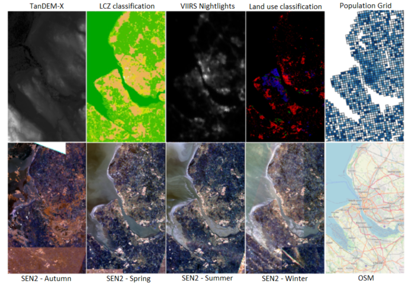

# Data Science in Earth Observation - Regression

## Helmholtz AI CountMeIn Challenge (April 11 to May 23, 2022)

[Helmholtz AI](https://www.helmholtz.ai/) is proud to announce an exciting data challenge: the Helmholtz AI CountMeIn Challenge. In this challenge, the participant teams will solve a challenging data science problem from the field of remote sensing: A spatially resolved estimate of the population based on satellite images. The task of the challenge is solving the problem up to a target accuracy with the smallest amount of resources possible. In two tracks, two of the most precious resources are addressed. In track GoGreen, the participant contribution wins that used as little energy. For the GoFast track, the task is to use as little time as possible.

This data challenge addresses a scientific audience, and therefore all participants are required to follow Good Scientific Practice. This means that for a valid submission, it is required to make code available, ensure reproducibility and document the steps to solution. The winning contributions to both tracks can present their solutions at the Helmholtz AI Conference.
For both tracks, you will be using the HAICORE installations located at Karlsruhe Institute of Technology (KIT) and Forschungszentrum Jülich (FZJ). The submission will happen on the newly formed [Helmholtz Data Challenges Platform](http://helmholtz-data-challenges.de/).

Even though the challenge ended, you can submit your results and compare the performance of your solution against the community on the [web](https://helmholtz-data-challenges.de/web/challenges/challenge-page/92/overview)




## Getting Started

To get started from scratch, please follow the steps:

1. Check that you have `python` installed in your system. Open a terminal (*power shell* in Windows), and then type:

```
python --version
```

You should see something like `Python 3.6.9`. This tutorial requires `python >= 3.6`. If you don't have python installed, visit [python.org](https://www.python.org/downloads/), and follow the instructions.

2. Get the code `git clone git@github.com:acamero/data-science-eo-regression.git`, and go to the new folder (e.g., `cd data-science-eo-regression`).

3. Download the data from this [link](https://syncandshare.lrz.de/getlink/fiELMVZd49ezrL4ZjKAvciPm/), and copy it to the folder `data-science-eo-regression/data`.

4. [Recommended] Create a virtual environment `virutalenv --python=python3.6 venv`), and activate it `source venv/bin/activate`.

5. Install *Jupyterlab* `pip install jupyterlab`.

6. Start *Jupyterlab* `jupyter-lab`, open the *notebook* `population_estimation.ipynb`, and follow the instructions.

**Note**: Please, be sure to complete steps 1 to 5 before the lecture, and to install all the required packages, either by running the first block of code of the notebook or by executing `pip install -r requirements`. Then, check that everything is ready by running `python check.py`. If the required packages are installed and the data is in place, you will get an `OK`.


